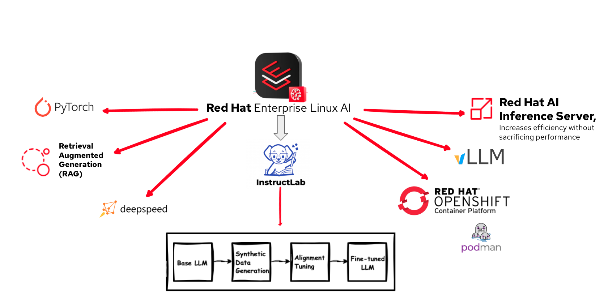
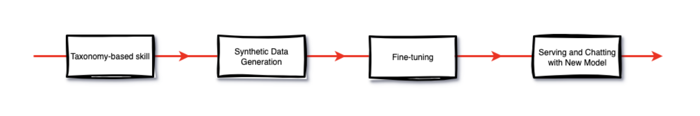
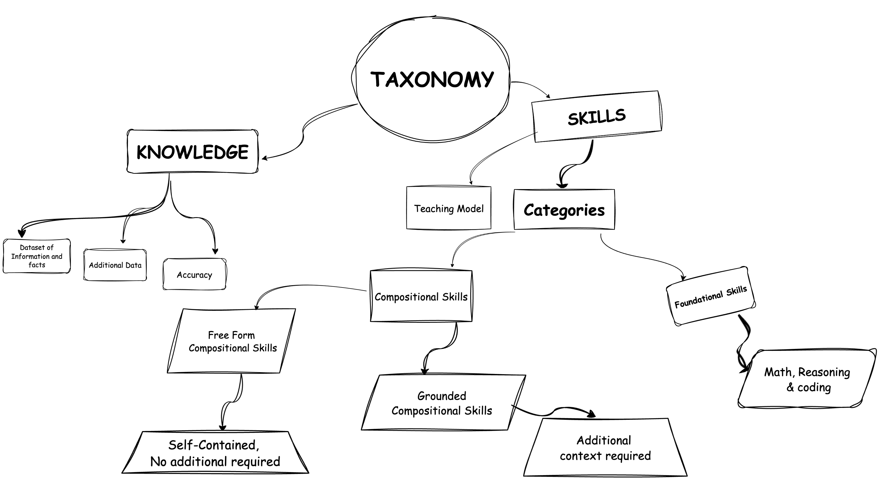
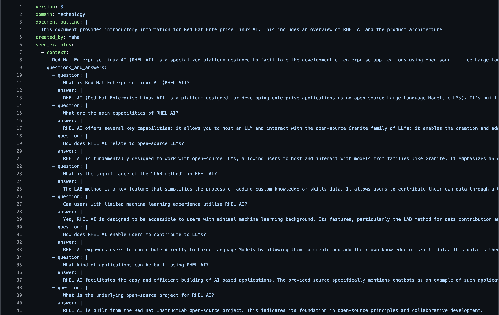

# RHEL AI Red Hat Summit Connet London 2025

# Unlocking Your Company’s Knowledge: Building an AI Assistant with RHEL AI 

# By Maha & Paulo - RHEL AI

## Overview

### Abstract - 1
Build a smart assistant using RHEL AI that learns from your internal knowledge base, delivering fast, accurate answers from technical documentation

### Abstract - 2
Nowadays, it’s more and more common for corporations with a large growth knowledge base, which takes hours to get the correct information or to make sure not to duplicate content. How can we use smart AI to help to solve this problem? And how does RHEL AI fine-tune help quickly unlock this for you?
In this session, we will start explaining a preprocessing of documents from multiple internal sources, cleaning and preparing the data, applying RHEAL AI fine-tune to faster, more effective retrieval, using taxonomy to tailor to the organisation's language, processes and priorities. During this session, you will also learn how the Retrieval Augmented Generation (RAG) pipeline can combine real-time documentation retrieval with the model to deliver fact-based context responses. Finally, we will demonstrate the AI assistant as an internal chatbot to demonstrate the use case.

## Problem Statement

The core problem is that crucial organisational knowledge—including Company policies, Employee Handbooks, Regulatory Compliance Standards and Standard Operating Procedures (SOPs) s severely fragmented and siloed across multiple, disparate platforms such as GitLab, Bitbucket, Confluence, GitHub, and various unindexed PDFs.
This lack of a single source of truth leads to three critical negative outcomes:

  1. Inefficiency and Time Waste: Employees spend a significant and unacceptable amount of time navigating and searching multiple tools, directly reducing productivity and diverting focus from core responsibilities.
  2. Duplication and Inconsistency: The scattering of data leads to the creation of duplicate, non-standardized, and often conflicting or outdated content, which organizations use at their own risk.
  3. High Risk of Non-Compliance: The difficulty in retrieving the authoritative, current version of a policy or standard increases the risk of employees making decisions based on incorrect information or failing to adhere to mandatory policies.
The clear solution required is the implementation of a centralised AI assistant capable of unifying this scattered data, providing employees with quick, reliable, and single-point access to the most accurate knowledge.

## Red Hat Enterprise Linux AI (RHEL AI)

### What is RHEL AI ?

RHEL AI is a foundational model platform from Red Hat for developing, testing, tuning and deploying Large-Language models (LLms) for enterprise use. It helps build AI Assitants to resolve the knowledge base problem.
Its combines of several platform like:.

* InstructLab 
* Granite Open Source LLMs
* Pytorch 
* Red Hat AI Inference Server
* Builtin Drivers for Accelerators 




## Collecting Knowledge Base

### Purpose:
To prepare and organize knowledge and skills data in support of taxonomy development.  

### Implementation Details:

*  Knowledge Integration:
   The generic RHEL AI instructions were incorporated into the knowledge and skills datasets to improve training quality and contextual accuracy.

*  Documentation Conversion:
   The Docling framework is used to automate documentation conversion and processing.

*  Processing Workflow:
   Docling parses and normalizes content from multiple document formats, simplifying the overall documentation pipeline.

*  Key Benefits:
    - Automated document parsing and conversion
    - Consistent data structure across formats
    - Improved efficiency and scalability

References: https://docling-project.github.io/docling/

## How the Fine-tuning process flow works ?



### Taxonomy

Taxonomy is the way we organize how the model learns. It’s essentially a tree that combines knowledge and skills so our assistant can understand both facts and how to perform tasks.

There are a few supported knowledge document types that you can use for training the starter Granite LLM. The current supported document types include:

* Markdown
* PDF

On the knowledge side, we provide datasets of information — facts, policies, product manuals — that help the model answer questions more accurately. This is usually added through simple qna.yaml files, where we map questions to answers based on our documents.

* Knowledge -

      Datasets that consists of Information and facts

* Skills -

      Datasets where you can teach the model how to do a task. 
      Its has two categories :-
    
      Compositional skills
      - Freeform: perform tasks without extra context.
      - Grounded: require context (e.g., reading a table with layout info).
      Foundation skills
      - Core abilities like math, reasoning, and coding.

Taxonomy File (QNA.YAML) - rhel-ai-RHSCLondon25-demo/taxonomy/qna_yaml_with_commit



### Synthetic Data Generation (SDG)

Synthetic Data Generation — process of expanding small seed examples into large training datasets. Uses a “teacher” large language model to generate Q&A variations or skill examples. The pipeline then scores, filters, and keeps only the most relevant and accurate pairs. The end result is a high-quality synthetic dataset we can use to fine-tune our AI assistant.

### Training a Model

Once we have our taxonomy and synthetic data, RHEL AI uses them to train a domain-specific model. The training follows a multi-phase process, where the system runs several stages of training and evaluation. At each stage, it produces checkpoints, and only the best-scoring checkpoint is carried forward. This iterative process ensures we end up with a high-quality model that is fine-tuned with our domain knowledge and skills.

### Evaluating the Model

If you want to measure the improvements of your new model, you can compare its performance to the base model with the evaluation process. You can also chat with the model directly to qualitatively identify whether the new model has learned the knowledge you created. If you want more quantitative results of the model improvements, you can run the evaluation process in the RHEL AI CLI

### Serving and Chatting with your New Model

After training, we deploy the model by serving it. This step makes the model available on our machine as an endpoint. Once it’s served, we can interact with it directly — chatting with the newly trained model and testing how well it responds using the knowledge and skills we taught it.
Serving makes the model available on your machine as an endpoint. Once served, you can interact and chat with the newly trained model in real time.


## DEMO

### Environment Setup and Installation

Deployed RHEL AI VM with an NVIDIA GPU 

* RHEL AI
* NVIDIA GPU
    - g6.xlarge (1x L4 with 24GB GPU memory)

```
 # cat /etc/os-release | grep VARIANT
   VARIANT="RHEL AI"
   VARIANT_ID=rhel_ai

```

``` 
  # ilab --version 
    ilab, version 0.26.1

```

#### Initialize the config (InstructLab CLI)

This command use to configure hardware vendor your system falls into and specific hardware configuration that most closely matches your system

```
  # ilab config init
``` 

 
#### Taxonomy - QNA File & Pattern update





#### Synthetic Data Generation (SDG)

Synthetic data was generated using the " ilab data generate " command based on the defined taxonomy

```
  # ilab data generate --taxonomy-path /root/.local/share/instructlab/taxonomy/knowledge/rhelai/qna.yaml --pipeline simple --gpus 1
```

##### Explanation
* --taxonomy-path: Points to the taxonomy YAML file defining domain-specific knowledge (RHEL AI Q&A)
* --pipeline simple: Uses the simple SDG pipeline suitable for PoC and initial model development
* --gpus 1: Enables GPU acceleration for faster synthetic data generation

#### Model Training

The synthetic data generated in the previous step was used to train the AI Model using the InstructLab training pipeline

``` 
  # ilab model train --pipeline=simple --device=cuda
```
##### Explanation
* --pipeline simple: Ensures compatibility with the SDG pipeline
* --device cuda: Uses GPU acceleration for efficient training

```
  # ilab model serve --model-path /root/.local/share/instructlab/checkpoints/xxxx-model-f16.gguf
```


